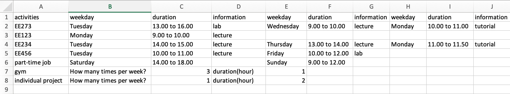
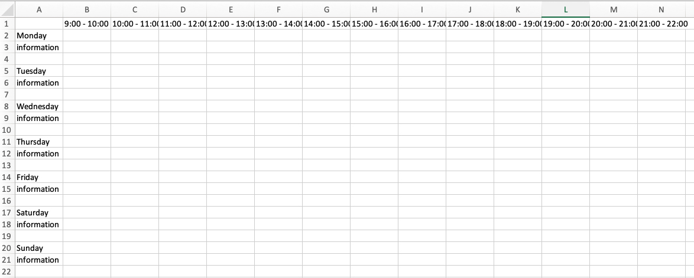
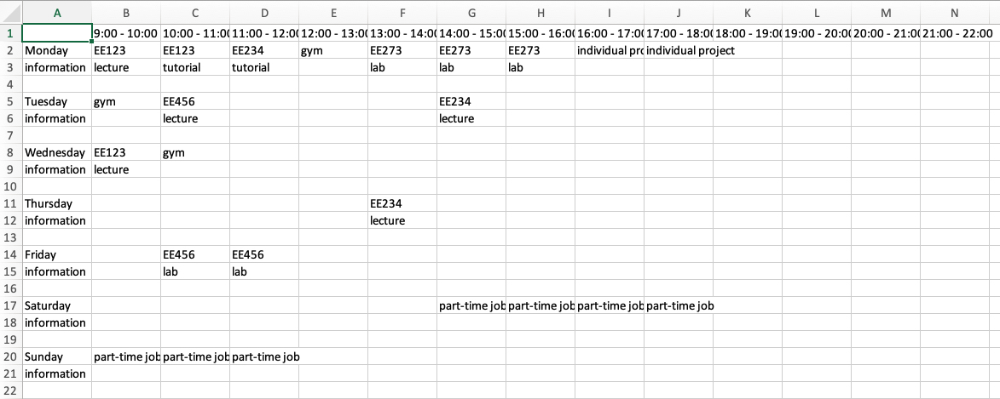

The aim of this project is to develop a software application that allows a student to plan and schedule their time to meet all these conflicting demands. 
It written with C++, as the final project for the course Software Engineering. The details of this project is explained below. 

Rather than being a rudimentary calendar that simply records times and dates, the user is allowed to enter activities and tasks, 
and the application will then allocate time (timetable) sufficient to meet the specified needs of the job. 

Another feature will be to allow the user to specify an activity of a particular type and total duration and to then schedule slots accordingly.
That is, say a report required for lab must be written and 3 hours is allowed for this task, 
the application may for example schedule three hour long slots within the week to for this task. 

We prepared a template for users to input their workload, the file would be used as input for the application.

The output file was an empty file like this

After processing user's input file, it would be filled up as user's designed schedule.

