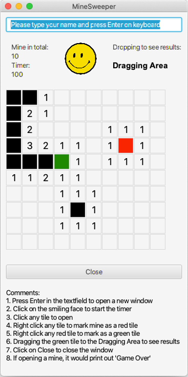

# Introduction of this program

This is the individual project on experiencing JavaFX. Here, I further developed Minesweeper with a focus on more interactive functions, which include timing, mouse left-click, right-click, keyboard entering and dragging. 

The detailed functions are described as follow:
1. Press Enter in the text field to open a new window
2. Click on the smiling face to start the timer
3. Click any tile to open
4. Right click any tile to mark mine as a red tile
5. Right click any red tile to mark as a green tile, (which means unsure about the tile, and wish to see the results of the tile)
6. Dragging the green tile to the Dragging Area to see results
7. Click on Close to close the window
8. If opening a mine, it would print out 'Game Over'

My contribution is to add the dragging function to Minesweeper. It will allow users to see the result of a tile without opening it, which reduced the game difficulty.

 
