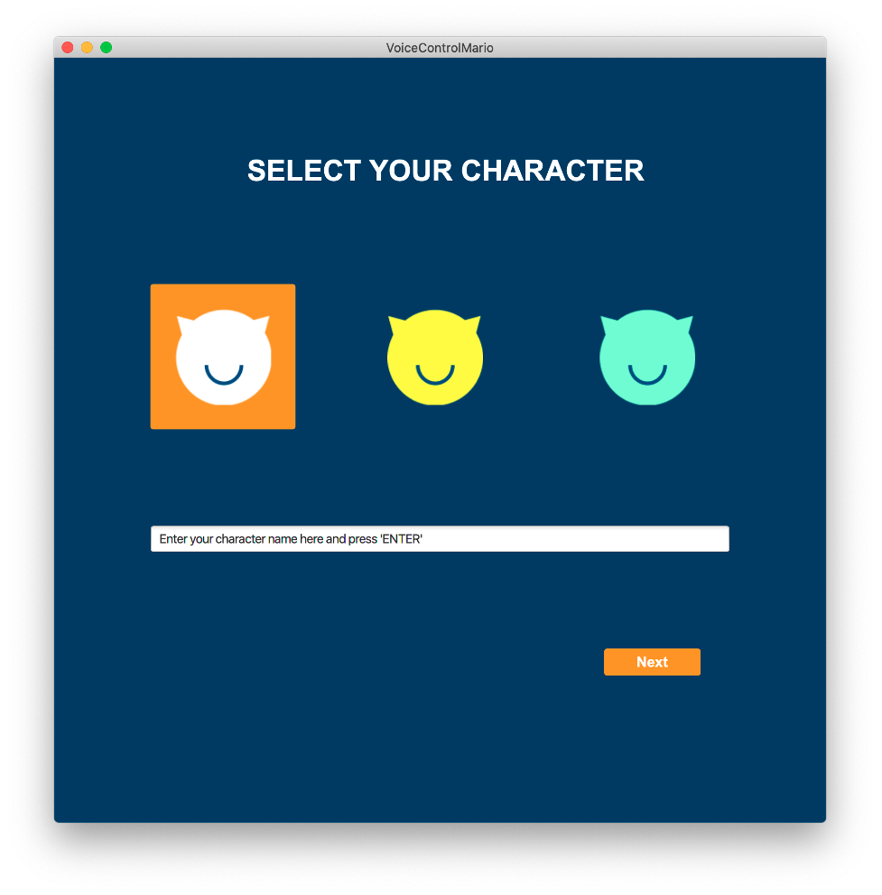
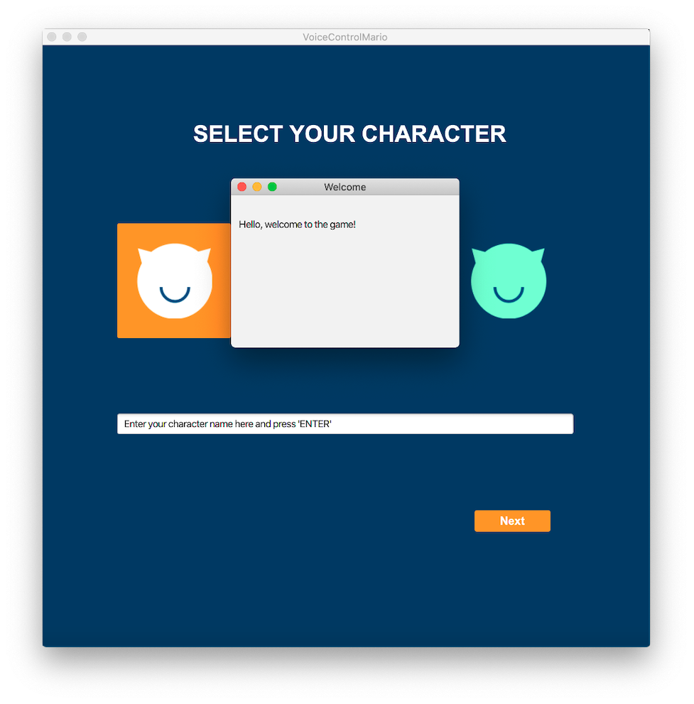
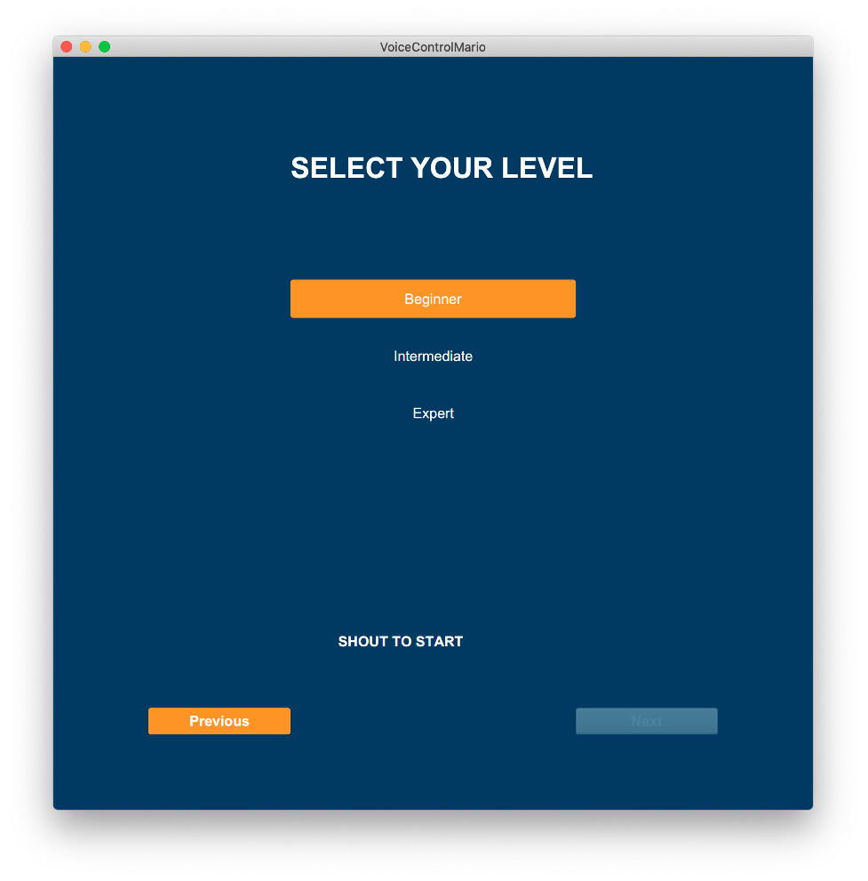
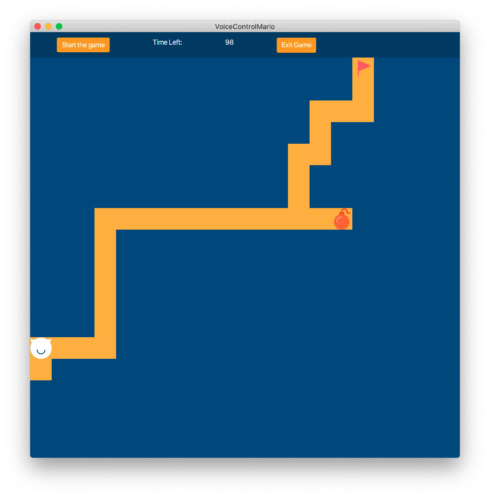

# An introduction to this program

This is a group project for developing a maze with voice control. 

The more detailed description is in the [Report](https://github.com/Eurus-J-Zhang/ProjectExperience/tree/main/VoiceMaze/Report.pdf). The idea development is documented in the [Storyboard](https://github.com/Eurus-J-Zhang/ProjectExperience/tree/main/VoiceMaze/Storyboad.pdf).

My contribution for this group work is to design and develop the interfaces, as well as the transition logic. 

     
    
